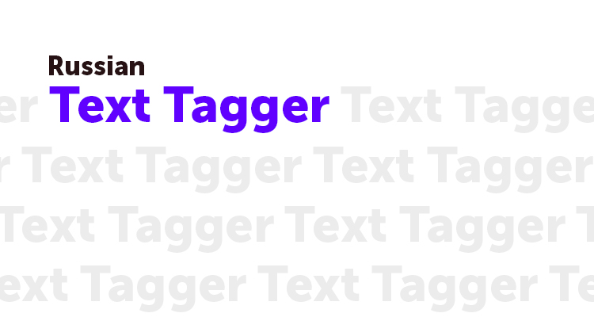

## 📚 Оглавление

- [📚 Оглавление](#-оглавление)
- [Описание](#описание)
- [Объяснение работы](#объяснение-работы)
- [Триггеры](#триггеры)
- [Инициализация Russian Text Tagger](#инициализация-russian-text-tagger)
- [Анализ текста](#анализ-текста)
- [Примеры использования](#примеры-использования)
  - [В браузере](#в-браузере)
  - [NodeJS](#nodejs)


## Описание

Эта маленькая библиотека призвана помочь в поиске словосочетаний и последовательностей русских слов в тексте.  
*Она не использует нейросети, работает на обыкновенных алгоритмах и на русском [словаре](https://github.com/deNULL/Az.js).*  

Для чего её можно использовать? Если коротко - для классификации.
Ты задаёшь триггер - а она возвращает его, если он был найден в тексте.


[Демка тут!](http://ilyich.ru/Russian-Text-Tagger/)

## Объяснение работы
Мы сделали массив с одним триггером, который срабатывает на наличие первичных форм слов **сколько**(norm:сколько), **стоит** (norm:стоить), **машина** (norm:машина) и **тачка** (norm:тачка).
```js
let triggers = [
    {
        name: "Вопрос про стоимость машина",
        words: [
            {normalized: ["сколько"]},
            {normalized: ["стоить"]},
            {normalized: ["машина", "тачка"]},
        ],
        markers: ['car_price']
    },
]
```

В этом случае Russian Text Tagger сработает на все следующие варианты:
`Сколько стоит машина`  
`Сколько стоит ваша машина`  
`Сколько стоит эта тачка`  
`Меня интересует сколько может стоить эта тачка`  
`машина сколько стоит?`  

```javascript
await Analysis("Меня интересует сколько может стоить эта тачка");
```  

Рассмотрим, как RTT разбирает текст на примере последнего варианта.
```
// Разделение текста на предложения (в нашем случае оно одно)
Меня интересует сколько может стоить эта тачка
-> ["Меня интересует сколько может стоить эта тачка"]

// Нормализация всех слов каждого предложения с помощью Az.js
Меня  интересует    сколько  может  стоить  эта   тачка
я     интересовать  сколько  мочь   стоить  этот  тачка

// Разделение на морфемы и получение их данных
я     интересовать  сколько  мочь  стоить  этот  тачка
NPRO  VERB          CONJ     VERB  INFN    ADJF  NOUN
+ 15 параметров по каждой, их можно использовать в триггерах.

// Перебор тригеров и поиск совпадений
Триггер triggers[0] ( сколько, стоить, тачка )
я  интересовать  сколько  мочь  стоить  этот  тачка
                 ¯¯¯¯¯¯¯        ¯¯¯¯¯¯        ¯¯¯¯¯

// Триггер найден, возвращаются его маркеры
-> ["car_price"]
```  

Результат работы RTT выглядит следующим образом:

```js
{
    "sentence": "Меня интересует сколько может стоить эта тачка",
    "sentences": ["Меня интересует сколько может стоить эта тачка"],
    "markers": ["car_price"],
    "triggered": [
        {
            "strict_word_direction": false,
            "strict_word_sequence": false,
            "name": "Вопрос про стоимость машина",
            "words": [
                {"normalized": ["сколько"]},
                {"normalized": ["стоить"]},
                {"normalized": ["машина","тачка"]}
            ],
            "markers": ["car_price"]
        }
    ],
    "morphs": [
        [
            {
                "source": "Меня интересует сколько может стоить эта тачка",
                "st": 0,
                "length": 4,
                "index": 0,
                "firstUpper": true,
                "allUpper": false,
                "type": "WORD",
                "subType": "CYRIL",
                "_str": "Меня",
                "POST": "NPRO",
                "text": "меня",
                "text_non_yo": "меня",
                "normalized": ["я","я"],
                "is_drugs": false,
                "is_god": false,
                "is_swear": false,
                "is_dangerous_people": false,
                "is_racism": false
            },
            {
                "source": "Меня интересует сколько может стоить эта тачка",
                "st": 4,
                "length": 1,
                "index": 1,
                "firstUpper": false,
                "allUpper": false,
                "type": "SPACE"
            },
            ...
        ]
    ]
}
```
Именно по маркерам можно определять какие совпадения были найдены в тексте.


## Триггеры
Триггеры - это объекты, содержащие в себе правила для поиска сочитаний.

```js

{ // (object) Триггер
    name, // (string) Название триггера
    words: [ // (array) Массив слов используемых триггером
        { // (object) Слово
            text //* (string||array) Слово для поиска
            normalized //* (string||array) Нормализованное слово для поиска
        }
    ],
    markers, // (array) массив маркеров, которые добавляются в итоговы результат
    check_scope, // (string) границы поиска сочитаний: 
                            // весь текст - undefined,
                            // предложение - "sentences"
    strict_word_sequence, // (bool) Маркер поиска строгой последовательности слов (буквально как указано в words)
    strict_word_direction, // (bool) Маркер поиска строгого направления слов (буквально как указано в words)
}
```

Объясняю **strict_word_sequence** и **strict_word_direction**.

При **strict_word_sequence** важно, чтобы слова стояли ровно в том же самом направлении и в тех же самых местах, как указано в words.
*При words: я, читаю, книги.*
✔ `я читаю книги`
✔ `знаешь, я читаю книги, а ты?`
✕ `я читаю умные книги`
✕ `я книги читаю`
✕ `умные книги я читаю`

При **strict_word_direction** важно, чтобы слова стояли ровно в том же самом направлении, как указано в words.
*При words: я, читаю, книги.*
✔ `я читаю книги`
✔ `знаешь, я читаю книги, а ты?`
✔ `я читаю умные книги`
✕ `я книги читаю`
✕ `умные книги я читаю`

Если оба параметра **не указаны** или являются false, то...
*При words: я, читаю, книги.*
✔ `я читаю книги`
✔ `знаешь, я читаю книги, а ты?`
✔ `я читаю умные книги`
✔ `я книги читаю`
✔ `умные книги я читаю`
Как ты понимаешь, здесь не важны ни последовательность, ни направление.

Вот так может выглядеть массив триггеров:
```js
let triggers = [
    {
        // (привет|хелоу|здарова|хай|прив)
        name: "Приветсвие",
        words: [{text: ["привет", "хелоу", "здарова", "хай", "прив"]}],
        markers: [1],
        check_scope: 'sentences'
    },
    {
        // в (какое|какие) (время|часы) вы (работаете)
        name: "Вопрос о времени работы",
        words: [
            {normalized: ["какой"]},
            {normalized: ["время", "час"]},
            {normalized: ["работать"]},
        ],
        markers: [2],
        check_scope: 'sentences'
    },
];
```

## Инициализация Russian Text Tagger

Чтобы создать новый объект Russian Text Tagger'а, достаточно выполнить функцию:
```js
let Analysis = require("russian-text-tagger")({
    triggers, // (array) Массив триггеров
    loadedAz, //* (object) Экземпляр инициализированной библиотеки Az.js
    uniq_markers // (bool) Возвращать без дубликатов маркеров
});
```

## Анализ текста

Просто даешь анализатору текст.
```js
let results = await Analysis("Как-то в зоопарке петух сказал петуху: Привет, петух!");
```

## Примеры использования
### В браузере
В браузере RTT нужно передать эксземпляр инициализированного Az.js.
```html
<script src="./az.min.js"></script>
<script src="./RTT/index.js"></script>
<script>
    Az.Morph.init('./dicts', function(){
        let rtt = RussianTextTagger({triggers, loadedAz: Az});
        let result = rtt("привет, друг!");
        console.log('result:', result);
    })
</script>
```

### NodeJS
``` javascript
let Analysis = require("russian-text-tagger")({triggers});

(async ()=>{
    let results = await Analysis("в какое время вы работаете?");
    console.log(results);
})();

```